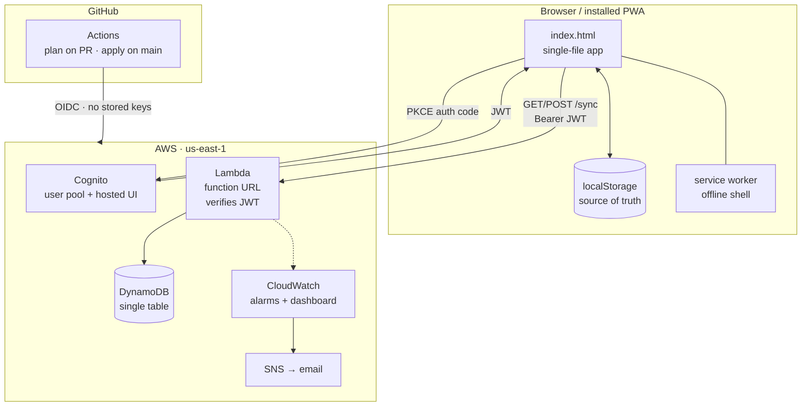

# Lift Log

An offline-first weight-training tracker, running on a serverless AWS backend built entirely with Terraform.

Log workouts set by set, see your previous performance inline while you lift, track personal records and estimated 1RM, and sync across devices. Works with no signal in a gym basement and uploads when you're back.

**Live:** [liftlog-rust.vercel.app](https://liftlog-rust.vercel.app) · installable as a PWA on iOS and Android

---

## Architecture



The client is the source of truth; the cloud is a replica. Every network call is best-effort, so losing connectivity degrades sync rather than the app.

### Request path

1. Browser gets a JWT from Cognito via authorization code flow with PKCE
2. Sends it as a bearer token to the Lambda function URL
3. Lambda verifies the RS256 signature against Cognito's JWKS, then checks `iss`, `aud`, `token_use` and `exp`
4. `sub` from the **verified** token becomes the DynamoDB partition key — `PK = USER#<sub>`

The client never states whose data it wants. That single derivation is the whole authorization model, and it's why a caller can't reach another user's records even by lying in the request body.

---

## Stack

| Layer | Choice | Why |
|---|---|---|
| App | Vanilla HTML/CSS/JS, one file | No build step; deploy is a file copy |
| Local storage | `localStorage` | Works offline, survives no-signal gyms |
| Auth | Cognito user pool, PKCE | 10k MAU free; no password handling of my own |
| API | Lambda function URL | Free permanently; API Gateway's tier is 12-month |
| Data | DynamoDB single table, on-demand | 25 GB always free, no idle cost |
| IaC | Terraform | Portable, plan/apply reviews well in CI |
| CI/CD | GitHub Actions + OIDC | No long-lived AWS credentials anywhere |
| Hosting | Vercel (S3 + CloudFront planned) | Already working; migration is Phase 5 |

**Zero npm dependencies** in both the app and the Lambda. The AWS SDK ships with the `nodejs20.x` runtime and JWT verification uses `node:crypto`, so Terraform zips the source directly.

---

## Cost

Steady state, verified against actual AWS pricing rather than estimated:

| Service | Free allowance | Actual |
|---|---|---|
| Lambda | 1M requests + 400k GB-s/month, never expires | $0 |
| DynamoDB | 25 GB, always free | ~$0.01 |
| Cognito | 10,000 MAU | $0 |
| S3 (state) | — | ~$0.01 |
| CloudWatch | 5 GB ingest, 7-day retention | ~$0 |
| SNS | 1,000 email notifications | $0 |

**Under $0.05/month**, and it stays there after promotional credits expire because nothing load-bearing sits in a time-limited tier.

Deliberately avoided: NAT Gateway (~$32/mo), RDS/Aurora (~$15+/mo), ALB (~$16/mo). Every one of those bills at zero traffic. A budget alarm at $5 catches anything unexpected.

---

## Repository layout

```
├── index.html              the entire app — UI, sync, offline
├── sw.js                   service worker
├── manifest.webmanifest    PWA manifest
├── icons/
├── api/
│   └── index.mjs           Lambda handler — JWT verify + /sync
├── infra/
│   ├── bootstrap/          run once: state bucket + budget alarm
│   ├── modules/
│   │   ├── data/           DynamoDB
│   │   ├── auth/           Cognito
│   │   ├── api/            Lambda, function URL, IAM, alarms
│   │   ├── observability/  SNS, dashboard
│   │   └── cicd/           OIDC provider, CI roles
│   └── PHASE*.md           build runbooks
├── docs/
│   ├── SECURITY.md         assessment, threat model, findings
│   ├── SECURITY-NEXT.md    backlog + decisions not to regress
│   ├── DECISIONS.md        architecture decision records
│   └── DEPLOY-VERCEL.md    original static-hosting guide
├── scripts/
│   └── pin-actions.sh      pin GitHub Actions to commit SHAs
├── CLAUDE.md               conventions, for humans and agents alike
└── .github/
    ├── dependabot.yml      weekly grouped action bumps
    └── workflows/
        ├── terraform.yml   plan on PR, apply on main
        └── security.yml    checkov, trivy, gitleaks, codeql, pin-check
```

---

## Running it

**Prerequisites:** AWS account, Terraform 1.11+, AWS CLI v2.

```bash
# once — creates the remote state bucket and a budget alarm
cd infra/bootstrap
terraform init && terraform apply

# everything else
cd ..
cp terraform.tfvars.example terraform.tfvars   # set callback_urls, alert_email
terraform init && terraform apply
```

`terraform output` gives the API URL, Cognito IDs, dashboard link and CI role ARNs. `infra/PHASE1.md` through `PHASE6.md` walk each stage with verification steps.

The app itself is static — open `index.html`, or serve the directory. No build.

---

## Features

**Logging** — set-by-set entry with weight, reps and RPE. Warm-up, drop and failure set types. Supersets. Per-exercise rest timers that skip automatically before a drop set. Previous performance shown inline beside each set.

**Analysis** — estimated 1RM (Epley), heaviest weight, best set and session volume, max weight per rep count, per-exercise history with charts. Live PR notifications when you beat a record.

**Planning** — reusable routines in folders, a 104-exercise library filterable by muscle and equipment, custom exercises.

**Progress** — weekly volume trends, sets per muscle group, a front/back body heat map, consistency calendar, body weight tracking.

**Data** — automatic cloud sync, dated backup files, in-app restore points, CSV export.

Warm-up sets are excluded from volume, PRs and muscle-group set counts, matching how lifters actually think about working sets.

---

## Testing

No framework — jsdom drives the real `index.html` and asserts on behaviour:

| Suite | Covers |
|---|---|
| App behaviour | Session flow, set types, rest timer, supersets, PR detection |
| Math | Epley 1RM, volume aggregation, rep records, warm-up exclusion |
| Storage robustness | Corrupted, null, wrong-type and empty localStorage |
| Backup | Export → fresh origin → import round-trip |
| Sync | Last-write-wins both directions, tombstones, token refresh, offline |
| JWT | Forged signatures, `alg: none`, HS256 confusion, expired, wrong issuer |
| Tenant isolation | Client-supplied `PK` is ignored |
| PWA | Manifest, meta tags, safe-area insets at simulated device sizes |

The JWT and tenant-isolation suites run against the actual handler with a generated keypair, so signature forgery is genuinely attempted rather than mocked.

---

## Decisions

[`docs/DECISIONS.md`](docs/DECISIONS.md) records the architecture choices and their tradeoffs, plus the six bugs that changed the design — including a data-loss bug in the sync ordering that tests caught before it reached real workouts, and an undocumented GitHub OIDC claim format that took four eliminated hypotheses to find.

---

## Security

[`docs/SECURITY.md`](docs/SECURITY.md) is the assessment: assets, trust
boundaries, threat model, and every finding with its severity, reasoning and
resolution. Notable entries include a CI role that was account-administrator
through `iam:*`, a deployment pipeline that silently reverted the Cognito
callback URLs and broke production sign-in, and a "sign out" that cleared local
tokens without ending the Cognito session — which made MFA impossible to test
and produced convincing evidence it was broken.

The write-ups keep the wrong turns rather than only the fixes, because the
failure modes generalise further than the patches do.

[`docs/SECURITY-NEXT.md`](docs/SECURITY-NEXT.md) carries what's left, the
recovery procedure for an MFA lockout, and a list of decisions that look like
oversights and are not. Read it before changing anything security-adjacent.

Static analysis runs on every push and weekly: Checkov, Trivy, gitleaks, CodeQL
and an action-pinning gate. Suppressions live inline on the resource with a
written reason — never in a skip list.
